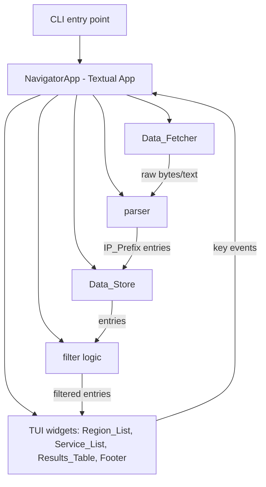
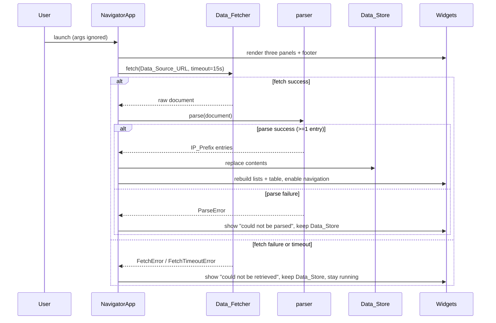

# Design Document

## Overview

The AWS Public IP Ranges Navigator is a keyboard-driven Terminal User Interface (TUI)
application written in Python. It fetches the AWS public IP ranges JSON document from a fixed
URL over HTTPS, parses it into structured entries, holds them in memory, and lets the user
filter and browse the entries interactively through a three-panel layout.

The design separates concerns into distinct, independently testable layers:

- A **networking layer** (`Data_Fetcher`) that performs HTTPS retrieval with a hard timeout.
- A **parsing layer** (`parser`) that converts the raw JSON into `IP_Prefix` entries, skipping
  invalid entries and distinguishing structural failure from a missing prefix collection.
- A **domain layer** (`Data_Store`, filter logic, selection state) that holds parsed data and
  computes filtered views. This layer is pure and side-effect free, which makes it the primary
  target for property-based testing.
- A **presentation layer** (the Textual TUI) that renders the panels, table, and key bar, and
  routes keyboard input to the domain layer.

This layering ensures that the logic most prone to subtle bugs — parsing and filtering — is
pure and exhaustively testable in isolation, while the terminal rendering concerns stay confined
to the presentation layer (addresses Requirements 2, 6, 11).

### Design Goals mapped to Requirements

- Launch with a single command, ignoring any supplied arguments (Requirement 1).
- Fetch current data on start and on demand, with a 15-second timeout and graceful failure
  (Requirement 2, 9).
- Present distinct Regions and Services with an `ALL` entry in each list (Requirement 3).
- Support Tab-based panel switching and arrow-key navigation with boundary clamping and scrolling
  (Requirement 4, 5).
- Filter the results table by Region and Service, including `ALL` semantics for both, with a
  count that equals the number of displayed rows (Requirement 6).
- Clear the filter and reload data without restarting, and quit cleanly restoring the terminal
  (Requirement 7, 9, 10).
- Show an always-visible key bar (Requirement 8).

## Screen Layout

The interface is a single full-screen view composed of three regions: a left **Selection_Panel**
that stacks the **Region_List** above the **Service_List**, a right **Results_Table**, and a
docked bottom **Footer** (the `Action_Bar`). The ASCII mockup below shows the arrangement; the
callout labels map each screen region to the widget/component that renders it (Requirement 3.3,
3.4, 3.5, 3.6, 3.7, 4.3, 6.4, 8.1, 12). Both selection lists are rendered vertically — one item
per line, arranged top-to-bottom — and each is its own independently scrollable list.

```
┌─ AWS Public IP Ranges Navigator (TUI) ──────────────────────────────────────────┐
│ Regions (↑/↓ to select)          │ Matching IP Prefixes (4 items found)          │
│ ❯ ap-northeast-1 (Tokyo)     ▲    │  # | IP Prefix (CIDR) | Region | Service      │
│   us-east-1 (N. Virginia)    █    │  1 | 52.94.0.0/22     | ap-...  | S3          │
│   eu-west-1 (Ireland)        █    │  2 | 52.219.0.0/20    | ap-...  | S3          │
│   ap-southeast-2 (Sydney)    ▼    │  3 | 3.5.140.0/22     | ap-...  | S3          │
│ Services (↑/↓ to select)          │  4 | 16.12.0.0/21     | ap-...  | S3          │
│   ALL                        ▲    │                                               │
│   EC2                        █    │                                               │
│ ❯ S3                         █    │                                               │
│   CLOUDFRONT                 █    │                                               │
│   ROUTE53                    ▼    │                                               │
├───────────────────────────────────────────────────────────────────────────────┤
│ [q] Quit   [r] Reload Data   [Tab] Switch Pane   [↑/↓] Navigate                   │
└───────────────────────────────────────────────────────────────────────────────┘
  ▲                                   ▲                                  ▲
  │                                   │                                  │
  └─ Selection_Panel (left)           └─ Results_Table (right)           └─ Footer / Action_Bar
     ├─ Region_List (top)                • DataTable widget                 (docked bottom;
     │   • ListView / OptionList         • header shows the live count      shows active bindings)
     │   • vertical, one item per line     = number of displayed rows
     │   • ❯ marks highlighted item      • columns: #, IP Prefix (CIDR),
     │   • own scrollbar on overflow       Region, Service
     └─ Service_List (bottom)            • built-in cursor + scrolling
         • ListView / OptionList
         • vertical, one item per line
         • ❯ marks highlighted item
         • own scrollbar on overflow
```

Both the Region_List and the Service_List are drawn vertically, one entry per line, with `❯`
marking the highlighted item in each. Each list scrolls independently: when a list has more items
than fit in its visible row area it shows its own scrollbar (the `▲ █ ▼` glyphs above the
right edge of each list stand in for that scrollbar), and scrolling one list does not move or
change the other (Requirement 3.6, 3.7, 12.5). Items in either list can also be clicked with the
mouse to select them, and each list can be scrolled with the mouse wheel or its scrollbar
(Requirement 12.1, 12.2, 12.7).

Region-to-component mapping:

- **Selection_Panel** — the left column; a vertical container holding the two selection lists
  stacked with the Region_List above the Service_List (Requirement 3.3).
  - **Region_List** — top list, rendered by a Textual `ListView`/`OptionList` as a vertical list
    (one item per line, top-to-bottom); shows `ALL` followed by the distinct regions, and scrolls
    independently with its own scrollbar when its items overflow the visible row area
    (Requirement 3.1, 3.4, 3.6).
  - **Service_List** — bottom list, rendered by a Textual `ListView`/`OptionList` as a vertical
    list (one item per line, top-to-bottom); shows `ALL` followed by the distinct services, and
    scrolls independently with its own scrollbar when its items overflow the visible row area
    (Requirement 3.2, 3.5, 3.7).
- **Results_Table** — the right column, rendered by a Textual `DataTable` with the columns `#`,
  `IP Prefix (CIDR)`, `Region`, `Service`; its header carries the count of matching prefixes, which
  equals the number of displayed rows (Requirement 6.4, 6.5).
- **Footer / Action_Bar** — docked at the bottom, rendered by a Textual `Footer`; always visible and
  populated from `BINDINGS`, so it lists `[q] Quit`, `[r] Reload Data`, `[Tab] Switch Pane`, and
  `[↑/↓] Navigate` (Requirement 8).

Focus and highlight indication:

- The **selected item** within each list is marked with the `❯` caret and rendered with the list's
  highlight style (Requirement 3.4, 5).
- The **Active_Panel** (the list that currently has focus) is visually distinguished — for example,
  a highlighted border/title on the focused list — so the user can tell which list Up/Down and
  selection will act on; `Tab` moves this active indication between the Region_List and the
  Service_List (Requirement 4.1, 4.2, 4.3).

## Architecture

### Framework choice: Textual

The application uses [Textual](https://textual.textualize.io/) as the TUI framework.

**Rationale.** The requirements describe a layout of stacked selection lists on the left, a
scrollable results table on the right, a docked bottom key bar, focus switching between panels,
and highlighted selection. Textual provides first-class widgets and behaviors that map directly
onto these requirements, which avoids re-implementing terminal primitives by hand:

- **`DataTable`** renders the `Results_Table` with columns, a built-in cursor, row scrolling, and
  a header — matching the row/column display and scrolling needs (Requirement 6.4, 5.6). Content
  was rephrased for compliance with licensing restrictions; per the [Textual DataTable docs](https://github.com/Textualize/textual/blob/main/docs/widgets/data_table.md)
  the widget supports data updates and cursor-based navigation.
- **`ListView` / `OptionList`** render the `Region_List` and `Service_List` as vertical lists with a
  highlighted selected item and keyboard navigation (Requirement 3.4, 3.5, 5). These widgets also
  support **mouse interaction**: clicking an item selects it, the mouse wheel scrolls the list, and a
  scrollbar appears automatically when the items overflow the visible area — emitting the same
  selection/highlight messages on mouse input as on keyboard input, so click-to-select and scroll
  come from the widgets already chosen with no extra machinery (Requirement 12).
- **`Footer`** is docked to the bottom and displays the active key bindings — a direct fit for the
  `Action_Bar` (Requirement 8). Per the [Textual Footer docs](https://textual.textualize.io/widgets/footer/),
  it shows available keybindings for the focused context.
- **`BINDINGS`** declaratively bind keys (`q`, `r`, `x`, Tab, arrows) to actions, and the same
  binding metadata drives the footer text, keeping the key bar and behavior in sync (Requirement 8).
- **Focus management** provides a clear notion of which widget is active, backing the `Active_Panel`
  concept and its visual indication (Requirement 4).
- Textual runs its own event loop with `async` workers, so the 15-second fetch runs off the UI
  thread and the interface stays responsive and running during and after a failed fetch
  (Requirement 2.6, 2.4).
- **Mouse support** — Textual's `ListView`/`OptionList` and `DataTable` handle mouse interaction in
  addition to keyboard: clicking an item selects it, the scroll wheel scrolls the widget, and a
  scrollbar is drawn automatically on overflow. This satisfies the mouse selection and scrolling
  requirement without extra machinery — the same widgets serve both input methods (Requirement 12).

**Alternative considered — `curses`.** The Python standard library `curses` module avoids a
third-party dependency, but it offers only low-level primitives: there is no built-in table,
scrolling list, focus model, or footer. Every panel, the highlight logic, scroll math, and key-bar
rendering would be hand-built, which is more code and more defect surface for exactly the behaviors
Textual already provides and tests. Given the layout and interaction requirements, Textual's
higher-level widgets are the better fit. The one tradeoff — an added dependency — is acceptable for
a released application and is offset by reduced custom terminal code.

### Layered structure



The `NavigatorApp` orchestrates: on start and on reload it calls the `Data_Fetcher`, passes the
result to the `parser`, and — only on success — replaces the `Data_Store` contents and rebuilds the
lists and table (Requirement 2.3, 9.2, 9.3). On failure it leaves the `Data_Store` unchanged and
shows a non-fatal error (Requirement 2.4, 2.6, 2.7).

### Startup and reload flow



## Components and Interfaces

### Data_Fetcher

Responsible for HTTPS retrieval of the IP ranges document (Requirement 2.1, 2.2, 2.6).

```python
def fetch_ip_ranges(url: str, timeout_seconds: float = 15.0) -> str:
    """Retrieve the IP ranges document over HTTPS.

    Returns the response body as text on success.
    Raises FetchTimeoutError if the complete document is not received within
    timeout_seconds. Raises FetchError for any other retrieval failure
    (connection errors, non-success status, etc.).
    """
```

- Uses the standard library `urllib.request` with an explicit `timeout` (or an equivalent HTTPS
  client) so no complete-document read exceeds 15 seconds; on expiry it aborts and raises
  `FetchTimeoutError` (Requirement 2.6).
- Enforces HTTPS by construction: the caller passes `Data_Source_URL`
  (`https://ip-ranges.amazonaws.com/ip-ranges.json`), which is a module constant (Requirement 2.1).
- Uses `with` for the network resource so the connection is always released, per the project's
  cleanup guideline.
- The fetcher does not touch the `Data_Store`; it only returns text or raises. This keeps the
  "retain existing data on failure" decision entirely in the orchestrator (Requirement 2.4).

### parser

Converts the raw document into `IP_Prefix` entries (Requirement 2.5, 2.8, 11).

```python
def parse_ip_ranges(document_text: str) -> list[IP_Prefix]:
    """Parse the IP ranges document into IP_Prefix entries.

    Reads the IPv4 prefix collection ("prefixes"), producing one IP_Prefix per
    entry that has a non-empty CIDR, region, and service. Entries missing, empty,
    or blank in any of those three fields are skipped.

    Raises StructuralParseError if the text is not a structurally valid document
    (for example, not valid JSON, or not an object).
    Raises MissingPrefixCollectionError if the document is structurally valid but
    does not contain the expected prefix collection.
    """
```

Parsing distinguishes three outcomes, matching Requirement 11:

1. **Structural failure** — the text cannot be interpreted as a document (invalid JSON, or the
   top level is not an object). Raise `StructuralParseError` (Requirement 11.2).
2. **Missing prefix collection** — valid document, but the expected prefix collection key is
   absent. Raise `MissingPrefixCollectionError` (Requirement 11.3).
3. **Per-entry validation** — for each entry in the collection, include it only if its CIDR,
   region, and service are all present and non-blank (after trimming whitespace); otherwise skip
   it and continue (Requirement 2.8, 11.4).

The AWS document uses the IPv4 prefix collection under the `prefixes` key, where each entry carries
`ip_prefix`, `region`, and `service` fields. The parser maps these to `IP_Prefix(cidr, region,
service)` (Requirement 11.1). The two parse-failure conditions are represented by distinct
exception types so the orchestrator can show the correct message ("could not be parsed") and the
`Data_Store` is left unchanged in both cases (Requirement 2.7, 11.2, 11.3).

Note on Requirement 2.7 vs 11: the orchestrator treats "parsed fewer than one entry" as a failure
for the purpose of the UI message. A structurally valid document with a present-but-empty prefix
collection yields zero entries; the orchestrator does not replace the `Data_Store` and shows the
parse-error message (Requirement 2.7), reusing the same non-fatal error display.

### Data_Store

The in-memory representation of parsed entries (Requirement 2.3, 3).

```python
@dataclass
class Data_Store:
    entries: list[IP_Prefix] = field(default_factory=list)

    def replace(self, new_entries: list[IP_Prefix]) -> None:
        """Replace all entries atomically (used only on successful reload)."""

    def regions(self) -> list[str]:
        """Distinct regions present, sorted, for building the Region_List."""

    def services(self) -> list[str]:
        """Distinct services present, sorted, for building the Service_List."""
```

- `replace` swaps the entire contents in one step so a reload never leaves a partially updated
  store; it is called only after a fully successful fetch+parse (Requirement 2.3, 9.2).
- `regions()` and `services()` return the distinct values used to build the selection lists; the
  presentation layer prepends the `ALL` entry when rendering (Requirement 3.1, 3.2).

### filter logic

Pure functions that compute the filtered view (Requirement 6).

```python
ALL = "ALL"

def filter_entries(
    entries: list[IP_Prefix], region: str, service: str
) -> list[IP_Prefix]:
    """Return entries matching the selection.

    An entry matches when (region == ALL or entry.region == region) AND
    (service == ALL or entry.service == service). Order of input is preserved.
    """
```

- A single predicate expresses all four selection combinations: specific/specific, ALL/specific,
  specific/ALL, ALL/ALL (Requirement 6.1, 6.2, 6.3).
- Input order is preserved so the sequential row numbers in the table are stable and gap-free
  (Requirement 6.4).
- When nothing matches, the function returns an empty list, which the table renders as zero rows
  with a count of zero (Requirement 6.6).

### TUI layer (NavigatorApp)

A Textual `App` subclass that owns the widgets, bindings, focus, and orchestration.

```python
class NavigatorApp(App):
    BINDINGS = [
        Binding("q", "quit", "Quit"),
        Binding("r", "reload", "Reload"),
        Binding("x", "clear_filter", "Clear filter"),
        Binding("tab", "switch_pane", "Switch pane"),
        Binding("up", "nav_up", "Navigate", show=True),
        Binding("down", "nav_down", "Navigate", show=True),
    ]
```

Responsibilities:

- **Compose layout** — a horizontal split with the `Selection_Panel` (Region_List above
  Service_List) on the left and the `Results_Table` on the right, and a `Footer` docked at the
  bottom (Requirement 3.3, 8.1).
- **Focus / Active_Panel** — exactly one selection list holds focus; Tab toggles it and the focused
  list is visually distinguished (Requirement 4.1, 4.2, 4.3).
- **Navigation** — Up/Down move the highlighted item within the focused list, clamping at the ends
  and scrolling to keep the selection visible; empty lists ignore the keys (Requirement 5). The
  DataTable/ListView cursor and scrolling provide the sub-100ms movement (Requirement 5.1, 5.2,
  5.6).
- **Mouse selection** — clicking an item in either list selects that item and makes that list the
  Active_Panel, then applies the filter for the new selection just as a keyboard selection would
  (Requirement 12.1, 12.2, 12.3). A click within a list's visible area that lands on no item leaves
  that list's selection unchanged but still makes that list the Active_Panel (Requirement 12.4).
- **Mouse scrolling** — each list is independently scrollable via its scrollbar and the mouse wheel
  when it overflows, and scrolling one list changes only that list's visible window without changing
  the selected item, the Filter_Selection, the Results_Table, or the other list (Requirement 12.5,
  12.7); a list that does not overflow shows no scrollbar and ignores wheel input (Requirement 12.6).
- **Mouse handling via existing widgets** — Textual's `ListView`/`OptionList` emit
  selection/highlight messages on both keyboard and mouse interaction and provide scrollbars
  automatically on overflow, so click-to-select and scroll are handled through the same widgets
  already chosen for keyboard navigation. The app routes a mouse-driven selection change into the
  same filter-application path as a keyboard-driven one, so no new widget is introduced
  (Requirement 12).
- **Filter application** — whenever a selection changes, recompute `filter_entries` and repopulate
  the table, updating the header count (Requirement 6). The count is derived from the same list
  used to build rows, so it always equals the row count (Requirement 6.5).
- **Actions** — `reload` re-runs fetch+parse and, on success, rebuilds lists and re-applies the
  current filter (Requirement 9); `clear_filter` resets the selection to its initial state
  (Requirement 7); `quit` exits and Textual restores the terminal on teardown (Requirement 10).
- **Error display** — fetch and parse errors are shown in a non-blocking notification/status region
  while the app keeps running (Requirement 2.4, 2.6, 2.7).

## Data Models

### IP_Prefix

An immutable value representing one AWS public IP range entry (Requirement 2.5, 11.1).

```python
@dataclass(frozen=True)
class IP_Prefix:
    cidr: str      # e.g. "52.94.0.0/22"
    region: str    # e.g. "ap-northeast-1"
    service: str   # e.g. "EC2"
```

`frozen=True` because a parsed entry is a fact about the fetched data and must not mutate after
creation; immutability also makes entries safe to share between the store, filter, and table, and
hashable for distinct-value computation.

### Filter_Selection

The current selection state driving the table (Requirement 6, 7).

```python
@dataclass
class Filter_Selection:
    region: str = "ALL"
    service: str = "ALL"

    @classmethod
    def initial(cls) -> "Filter_Selection":
        """The unfiltered default: region ALL, service ALL."""
        return cls(region="ALL", service="ALL")
```

- Mutable because it changes as the user navigates; the initial (reset) state is `ALL`/`ALL`, which
  the clear-filter action restores (Requirement 7.1).
- The reset returns the unfiltered view, so after clearing, the table shows every entry
  (Requirement 7.2).

### Selection list model

Each selection list is the distinct values from the store with `ALL` prepended:

```
Region_List  = ["ALL"] + Data_Store.regions()
Service_List = ["ALL"] + Data_Store.services()
```

This keeps `ALL` always available and first, and rebuilds cleanly on reload (Requirement 3.1, 3.2,
9.2).

## Source Code Structure

The source is split by feature/responsibility into small modules, one per component from the
"Components and Interfaces" section, following the project's `src/` + `tests/` + `.kiro/specs/`
directory convention. The split isolates the **pure, testable logic** (`models`, `parser`,
`store`, `filtering`, `navigation`) from **I/O** (`fetcher`) and from **presentation**
(`app`), so the layers described in the Architecture map one-to-one onto files.

```
aws-public-ip-ranges-navigator/
├── src/
│   └── aws_ip_navigator/
│       ├── __init__.py            # Package marker; exposes the public API / version.
│       ├── __main__.py            # CLI entry point (python -m aws_ip_navigator); ignores args, launches NavigatorApp.
│       ├── models.py              # IP_Prefix and Filter_Selection dataclasses (pure data).            [PBT target]
│       ├── errors.py              # NavigatorError exception hierarchy (Fetch/Parse subclasses).
│       ├── fetcher.py             # Data_Fetcher: HTTPS retrieval with a 15s timeout (I/O layer).
│       ├── parser.py              # parse_ip_ranges: JSON -> IP_Prefix, skips invalid entries.          [PBT target]
│       ├── store.py               # Data_Store: replace(), distinct regions()/services().               [PBT target]
│       ├── filtering.py           # filter_entries: pure Region/Service filter logic incl. ALL.         [PBT target]
│       ├── navigation.py          # Clamped selection-index and scroll-offset math (pure).              [PBT target]
│       └── app.py                 # NavigatorApp (Textual App): layout, focus, bindings, orchestration.
├── tests/
│   ├── test_models.py             # Property/example tests for IP_Prefix and Filter_Selection.          [PBT: P1, P14, P15 support]
│   ├── test_parser.py             # Property tests for parsing round-trip, skips, and error modes.      [PBT: P1–P4]
│   ├── test_filtering.py          # Property tests for filter correctness, count/rows, mouse/keyboard eq. [PBT: P6, P7, P8, P16]
│   ├── test_store.py              # Property tests for list derivation and replace semantics.           [PBT: P5, P12]
│   ├── test_navigation.py         # Property tests for clamped navigation, scroll visibility, invariance. [PBT: P9, P10, P17]
│   ├── test_fetcher.py            # Mock-based/integration tests for HTTPS fetch and timeout.
│   └── test_app.py                # Textual run_test harness: launch, focus/Tab, bindings, reload, quit, mouse click/scroll.
├── pyproject.toml                 # Project metadata + deps: textual, hypothesis, pytest.
└── README.md                      # Usage and run instructions.
```

Module-to-component mapping and responsibilities:

| Module | Component (from Components and Interfaces) | Responsibility | Layer |
|--------|-------------------------------------------|----------------|-------|
| `models.py` | `IP_Prefix`, `Filter_Selection` | Immutable prefix entry and mutable selection state | Domain (pure) |
| `errors.py` | Exception hierarchy | `NavigatorError` base with `FetchError`/`FetchTimeoutError`/`ParseError`/`StructuralParseError`/`MissingPrefixCollectionError` | Cross-cutting |
| `fetcher.py` | `Data_Fetcher` | `fetch_ip_ranges(url, timeout_seconds)` HTTPS retrieval; raises on failure/timeout | Networking (I/O) |
| `parser.py` | `parser` | `parse_ip_ranges(document_text)` JSON → `IP_Prefix`, skip invalid, distinguish failure modes | Domain (pure) |
| `store.py` | `Data_Store` | `replace()`, `regions()`, `services()` distinct-value derivation | Domain (pure) |
| `filtering.py` | filter logic | `filter_entries(entries, region, service)` with `ALL` semantics, order-preserving | Domain (pure) |
| `navigation.py` | selection/scroll math | Clamped index movement and scroll-offset computation | Domain (pure) |
| `app.py` | `NavigatorApp` (TUI layer) | Compose layout, focus/Active_Panel, `BINDINGS`, filter application, actions, error display | Presentation |
| `__main__.py` | CLI entry point | Launch with a single command, ignore supplied arguments | Entry point |

**Property-based-test targets.** The pure modules — `models.py`, `parser.py`, `store.py`,
`filtering.py`, and `navigation.py` — hold the logic exercised by the Hypothesis property tests
(Properties 1–17); their test files are marked `[PBT target]` above. The I/O module (`fetcher.py`)
and the presentation module (`app.py`) are verified with mock-based/integration and Textual
`run_test` example tests instead, since they exercise external I/O and terminal rendering rather
than pure input→output logic.

Mouse handling introduces no new module: it lives in `app.py` and reuses the existing pure logic —
click-to-select feeds `filtering.py` on the same path as a keyboard selection, and mouse scrolling
uses the scroll-offset math in `navigation.py`. Because that math computes the scroll offset
independently of the selected index, a scroll-only operation leaves the selected index unchanged
(Requirement 12.3 reuses `filtering.py`; Requirement 12.5, 12.7 relate to `navigation.py`).

## Correctness Properties

*A property is a characteristic or behavior that should hold true across all valid executions of
a system — essentially, a formal statement about what the system should do. Properties serve as
the bridge between human-readable specifications and machine-verifiable correctness guarantees.*

The parser, filter logic, selection-list derivation, and navigation/scroll math are pure functions
over large input spaces, which makes them well suited to property-based testing. The properties
below were derived from the acceptance criteria and consolidated to remove redundancy (for example,
the four filter combinations collapse into a single predicate property, and the navigation boundary
cases collapse into one clamped-navigation property).

### Property 1: Parse round-trip

*For any* list of valid IP_Prefix entries, serializing them into the AWS IP ranges document shape
and then parsing that document SHALL produce an equivalent list of IP_Prefix entries.

**Validates: Requirements 2.5, 11.1**

### Property 2: Parse skips invalid entries

*For any* IP ranges document whose prefix collection contains an arbitrary mix of valid entries and
entries with a missing, empty, or blank CIDR, Region, or Service, parsing SHALL return exactly the
valid entries in their original order and SHALL exclude every invalid entry.

**Validates: Requirements 2.8, 11.4**

### Property 3: Structural parse failure is reported

*For any* input text that is not a structurally valid document (not valid JSON, or a valid JSON
value that is not an object), parsing SHALL raise a structural parse error and SHALL not produce
any entries.

**Validates: Requirements 11.2**

### Property 4: Missing prefix collection is reported

*For any* structurally valid JSON object that does not contain the expected prefix collection,
parsing SHALL raise a missing-prefix-collection error distinct from the structural parse error.

**Validates: Requirements 11.3**

### Property 5: Selection list derivation

*For any* Data_Store contents, the derived Region_List (and likewise the Service_List) SHALL equal
the `ALL` entry followed by the distinct Region (respectively Service) values present in the store,
containing `ALL` exactly once and no duplicate values. This holds equally for the lists rebuilt
after a successful reload.

**Validates: Requirements 3.1, 3.2, 9.2**

### Property 6: Filter correctness across ALL and specific selections

*For any* list of IP_Prefix entries and any Region and Service selection (each either `ALL` or a
specific value), the filtered result SHALL contain exactly the entries for which
`(region == ALL or entry.region == region)` and `(service == ALL or entry.service == service)`
both hold, and SHALL exclude every entry for which either condition fails.

**Validates: Requirements 6.1, 6.2, 6.3**

### Property 7: Count equals displayed rows

*For any* list of IP_Prefix entries and any Filter_Selection, the count shown in the Results_Table
header SHALL equal the number of rows displayed, which SHALL equal the length of the filtered
result — including the case where no entry matches, in which the count and the row total are both
zero.

**Validates: Requirements 6.5, 6.6**

### Property 8: Sequential gap-free row numbering

*For any* filtered list of length n rendered in the Results_Table, the row numbers SHALL be exactly
the integers 1 through n in top-to-bottom order with no gaps, and the row at position i SHALL carry
the CIDR, Region, and Service of the i-th filtered entry.

**Validates: Requirements 6.4**

### Property 9: Clamped navigation within bounds

*For any* selection list and any current selection index, moving down SHALL increase the index by
one unless it is already at the last item (in which case it stays), moving up SHALL decrease the
index by one unless it is already at the first item (in which case it stays), the resulting index
SHALL always lie within the valid range of the list, and when the list is empty neither key SHALL
change the selection.

**Validates: Requirements 5.1, 5.2, 5.3, 5.4, 5.5**

### Property 10: Scroll keeps the selection visible

*For any* list length, viewport height, and selected index, the computed scroll offset SHALL satisfy
`offset <= index < offset + viewport_height`, and the offset SHALL remain within the valid range so
that the visible window never extends beyond the list bounds.

**Validates: Requirements 5.6**

### Property 11: Exactly one active panel and Tab toggles it

*For any* sequence of switch-pane (Tab) operations starting from a valid initial focus, exactly one
of the Region_List and Service_List SHALL be the Active_Panel after each operation, an even number
of Tab presses SHALL return focus to the starting panel, and an odd number SHALL leave focus on the
other panel.

**Validates: Requirements 4.1, 4.2**

### Property 12: Successful replace yields exactly the new entries

*For any* initial Data_Store contents and any newly parsed list of entries, after a successful
`replace`, the Data_Store contents SHALL equal exactly the new entries with no residue from the
previous contents.

**Validates: Requirements 2.3**

### Property 13: Failed fetch or parse retains the store

*For any* initial Data_Store contents, when a reload's fetch fails, times out, or yields fewer than
one parseable entry, the Data_Store contents SHALL be identical before and after the attempt and a
non-fatal error SHALL be surfaced.

**Validates: Requirements 2.4, 2.7**

### Property 14: Clear-filter resets to the unfiltered view

*For any* Filter_Selection, applying the clear-filter action SHALL yield the initial selection
(`ALL`/`ALL`), and for any Data_Store contents the filtered result under that reset selection SHALL
equal all entries in the store.

**Validates: Requirements 7.1, 7.2**

### Property 15: Command-line arguments are ignored

*For any* list of command-line argument strings, the resolved startup behavior SHALL equal the
behavior produced when no arguments are supplied.

**Validates: Requirements 1.2**

### Property 16: Mouse selection matches keyboard selection

*For any* Data_Store contents and any target item in the Region_List or the Service_List, a
click-driven selection change to that item SHALL produce the same Filter_Selection and the same
filtered result as a keyboard-driven selection to the same item. Both input paths feed the same
pure filter logic, so the resulting Results_Table is identical and consistent with Requirement 6.

**Validates: Requirements 12.1, 12.2, 12.3**

### Property 17: Scrolling leaves the selection invariant

*For any* list length, viewport height, selected index, and scroll amount, a scroll-only operation
(no item click) SHALL change only the visible window (the scroll offset, within its valid range)
and SHALL leave the selected index unchanged — and therefore leave the Filter_Selection and the
filtered result unchanged. This follows from the scroll-offset math in `navigation.py`, which
computes the offset independently of the selected index.

**Validates: Requirements 12.5, 12.7**

Requirement 12 also has device-level behaviors that are not pure input→output logic and so are not
property tests: the raw click hit-testing that maps a click to a list item (Requirement 12.1, 12.2
at the widget level) and the empty-position click (Requirement 12.4); the scrollbar/wheel scrolling
itself (Requirement 12.5); and the scrollbar presence/absence on overflow together with the
wheel-ignore rule for a non-overflowing list (Requirement 12.4, 12.6). These are provided by the
Textual `ListView`/`OptionList` widgets and are verified with example/Textual `run_test` tests
instead (see Testing Strategy).

## Error Handling

Errors are organized into a custom exception hierarchy so callers can branch on the specific type,
per the project's error-handling guideline. No error terminates the application: fetch and parse
failures are caught at the orchestrator, surfaced as a non-fatal message, and the app keeps running
with its existing `Data_Store` (Requirement 2.4, 2.6, 2.7).

```python
class NavigatorError(Exception):
    """Base class for all Navigator errors."""


class FetchError(NavigatorError):
    """The IP ranges document could not be retrieved."""


class FetchTimeoutError(FetchError):
    """The retrieval did not complete within the timeout (15s)."""


class ParseError(NavigatorError):
    """The IP ranges document could not be parsed."""


class StructuralParseError(ParseError):
    """The text is not a structurally valid document."""


class MissingPrefixCollectionError(ParseError):
    """The document is valid but lacks the expected prefix collection."""
```

Handling rules:

- **Fetch failure / timeout** — `Data_Fetcher` raises `FetchError` (or its `FetchTimeoutError`
  subclass). The orchestrator catches these specific types, shows "the data could not be
  retrieved", retains the `Data_Store`, and stays running (Requirement 2.4, 2.6).
- **Parse failure** — `parser` raises `StructuralParseError` or `MissingPrefixCollectionError`. The
  orchestrator catches `ParseError`, shows "the data could not be parsed", retains the `Data_Store`,
  and stays running (Requirement 2.7, 11.2, 11.3).
- **Zero parseable entries** — a structurally valid document with an empty prefix collection yields
  an empty list; the orchestrator treats this as a parse failure for the UI message and does not
  replace the store (Requirement 2.7).
- **No bare `except`** — each handler catches a specific exception type from the hierarchy; unknown
  exceptions are not silently swallowed.
- **Resource cleanup** — network resources are acquired with `with`, and any teardown that must run
  regardless of outcome uses `try/finally`, guaranteeing the terminal is restored on exit
  (Requirement 10.2).

The distinct exception types let the orchestrator select the correct message and let tests assert
the exact failure mode (structural vs missing collection vs timeout).

## Testing Strategy

The strategy combines property-based tests for the pure logic with example and integration tests
for wiring, layout, and lifecycle concerns.

### Property-based tests (Hypothesis)

The parser, filter, list derivation, navigation, scroll math, and store update logic are pure and
input-driven, so they are tested with [Hypothesis](https://hypothesis.readthedocs.io/). Property
tests are NOT implemented from scratch; Hypothesis generates inputs and shrinks failing cases.

- Library: **Hypothesis** with **pytest**.
- Each of Properties 1–17 is implemented by a **single** property-based test.
- Each property test runs a **minimum of 100 iterations** (Hypothesis `max_examples >= 100`).
- Each property test is tagged with a comment referencing its design property, in the format:
  `# Feature: aws-public-ip-ranges-navigator, Property {number}: {property_text}`
- Custom Hypothesis strategies generate: valid `IP_Prefix` entries; documents mixing valid and
  invalid entries (missing/empty/blank fields); malformed non-JSON and non-object texts; JSON
  objects lacking the prefix collection; lists with an index and a viewport height for navigation
  and scroll; a store with a target item reached by either input device for the mouse/keyboard
  equivalence property; a list length, viewport height, selected index, and scroll amount for the
  scroll-invariance property; and arbitrary argument vectors for the CLI-ignored property.

Property-to-test mapping:

| Property | Focus | Requirements |
|----------|-------|--------------|
| P1  | Parse round-trip | 2.5, 11.1 |
| P2  | Parse skips invalid entries | 2.8, 11.4 |
| P3  | Structural parse error | 11.2 |
| P4  | Missing prefix collection error | 11.3 |
| P5  | Selection list derivation | 3.1, 3.2, 9.2 |
| P6  | Filter correctness (ALL/specific) | 6.1, 6.2, 6.3 |
| P7  | Count equals rows (incl. zero) | 6.5, 6.6 |
| P8  | Sequential gap-free numbering | 6.4 |
| P9  | Clamped navigation | 5.1–5.5 |
| P10 | Scroll visibility | 5.6 |
| P11 | One active panel; Tab toggles | 4.1, 4.2 |
| P12 | Replace yields exactly new entries | 2.3 |
| P13 | Retain store on failure | 2.4, 2.7 |
| P14 | Clear-filter resets to full view | 7.1, 7.2 |
| P15 | CLI arguments ignored | 1.2 |
| P16 | Mouse selection matches keyboard selection | 12.1, 12.2, 12.3 |
| P17 | Scrolling leaves the selection invariant | 12.5, 12.7 |

### Unit tests (example-based)

Focused examples for behaviors that do not vary meaningfully with input:

- **Launch** — with no args and with arbitrary args, the app composes the three panels and footer
  (Requirement 1.1, 1.2 example side; 3.3, 8.1).
- **Startup ordering** — fetch is initiated during startup before navigation is enabled, using a
  mocked fetcher (Requirement 1.3).
- **Bindings / Action_Bar** — the footer exposes `x`→clear, `q`→quit, `r`→reload, Tab→switch-pane,
  Up/Down→navigate, each with a visible description (Requirement 8.2–8.6).
- **Highlight and active indicator** — the selected item is highlighted and the active-panel
  indicator moves on Tab (Requirement 3.4, 4.3).
- **Mouse click selection** — clicking an item in a list selects it and makes that list the
  Active_Panel; clicking an empty position within a list leaves the selection unchanged but still
  makes that list active (Requirement 12.1, 12.2, 12.4). Verified with Textual `run_test`, since the
  click hit-testing is widget behavior rather than pure logic.
- **Scrollbar presence and wheel handling** — a list whose items overflow its visible area shows a
  scrollbar and scrolls on the mouse wheel independently of the other list; a list that does not
  overflow shows no scrollbar and ignores wheel input (Requirement 12.5, 12.6). Verified with
  Textual `run_test`.

### Integration / mock-based tests

For external I/O and lifecycle, using mocks and 1–3 representative examples rather than many
iterations:

- **HTTPS fetch on start and reload** — the HTTP client is invoked with the fixed HTTPS
  `Data_Source_URL` on startup and on `r` (Requirement 2.1, 2.2, 9.1). Mocked so no real network
  call is made.
- **Timeout** — a fetcher configured with a 15-second timeout that exceeds it raises
  `FetchTimeoutError`; the orchestrator shows the retrieval error and the app remains running
  (Requirement 2.6).
- **Successful reload** — on success the store is replaced, the lists are rebuilt, and the table is
  re-applied against the current selection (Requirement 9.2, 9.3) — the pure parts are already
  covered by P5, P12, and P6; the integration test verifies the wiring end to end.
- **Quit / terminal restore** — pressing `q` exits the session and the framework teardown restores
  the terminal (Requirement 10.1, 10.2), verified via Textual's test harness (`run_test`).

### Test layout

Tests live under `tests/`, mirroring `src/` modules (parser, filter, store, navigation, app),
consistent with the project directory convention.
